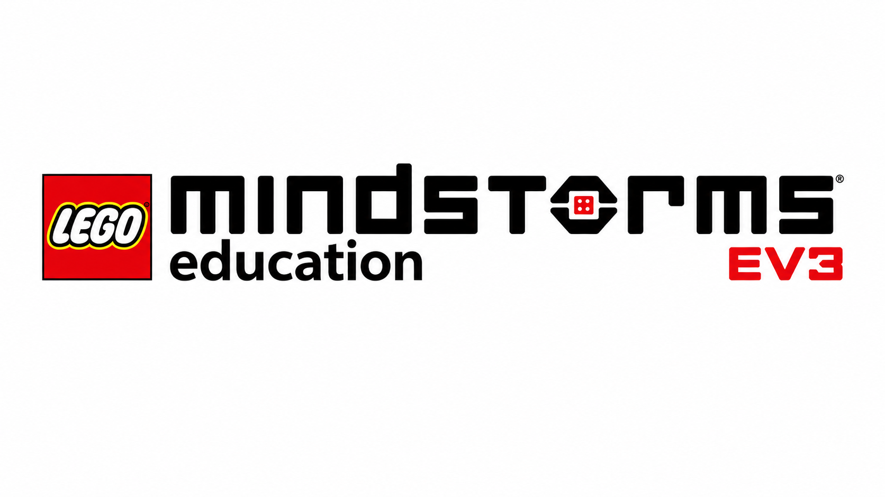
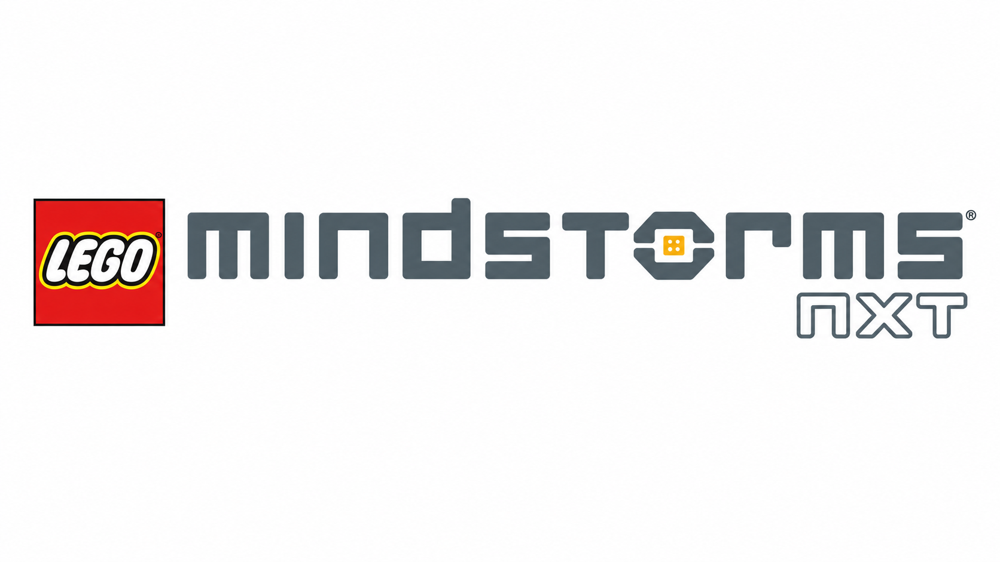
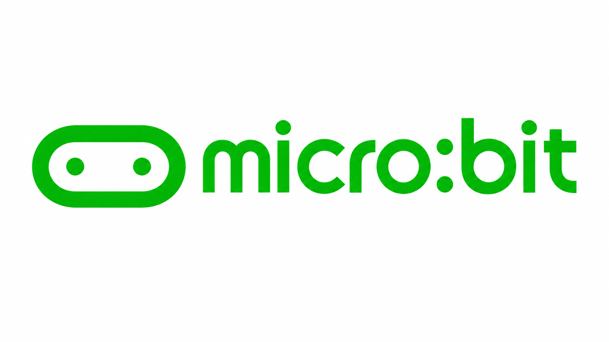

<h1 align="center">
  Hello  i'm Apilak Tongthaisong
  

</h1>

  <big>
    <big>
      <strong>
        Code the future. Create your own path. 💻⚡🔥
      </strong>
    </big>
  </big>

  

 👋 Hello, I'm Apilak Tongthaisong

🎓 Computer Engineering Student

I am interested in programming, web development, and technology.  
Currently learning C, HTML, CSS, JavaScript, Git, and GitHub.  
I enjoy creating projects and improving my skills.

<h1>🛠️ My Robotics Projects</h1>

<table align="center">
  <tr>
    <td align="center">
       
      <b>LEGO Mindstorms EV3</b>
    </td>
    <td align="center">
       
      <b>LEGO Mindstorms NXT</b>
    </td>
    <td align="center">
       
      <b>BBC micro:bit</b>
    </td>
  </tr>
</table>

<h2>⚡ About My Journey<h2>

  🤖 Robotics & Automation Enthusiast 
  💻 Programmer & Technology Lover 
  🛠️ Builder • Coder • Problem Solver 
